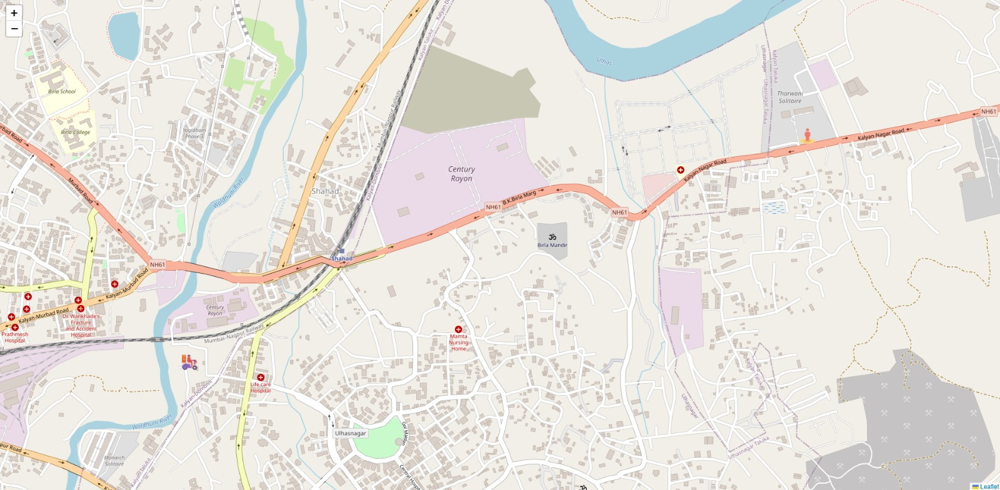

# LiveRide 🚴‍♂️📍

A real-time delivery tracking system that streams and visualizes rider movement using **Kafka**, **Socket.IO**, and **Leaflet**, with Dockerized infrastructure for local development and testing.

---

## 📺 Demo: Click on the below image to see the demo
[](https://drive.google.com/file/d/1Di-M8Z1CvoCftTJkJGBFIP22d_JgtjmQ/view?usp=sharing)

---

## 🔧 Tech Stack

- **Backend**: Node.js, KafkaJS, Socket.IO
- **Frontend**: Handlebars.js, Leaflet.js
- **Database**: MongoDB
- **Streaming Platform**: Apache Kafka, Zookeeper
- **Containerization**: Docker & Docker Compose

---

## ✨ Features

- 🚀 **Real-Time Rider Tracking**: Simulates and streams rider GPS locations via Kafka.
- 🗺️ **Live Map Visualization**: Displays rider locations on a Leaflet map with real-time updates using WebSockets.
- 📦 **Kafka Integration**: Uses Kafka producers to send and consumers to receive GPS data.
- 🧠 **Historical Data Storage**: Saves streamed locations to MongoDB for analytics and insights.
- 🧪 **Dockerized Setup**: Runs Kafka, Zookeeper, MongoDB, and the app locally via Docker Compose.

---

## 🚀 Getting Started

### 1. Clone the Repository

```bash
git clone https://github.com/Ashish48Maurya/LiveRide
cd LiveRide
```

### 2. Start Services with Docker

```bash
docker-compose up --build -d
```

This will start:

- Kafka
- Zookeeper

> ⚠️ Ensure Docker is installed and running.

---

If you have **Node.js** and **MongoDB** installed locally on your system, you can start the application with:

```bash
node index
```

---

## 🌍 Web UI

A simple web interface is provided to show real-time rider location on a map using Leaflet.
- Access the app at: `http://localhost:3000`


---

## 📊 Future Improvements

- Add authentication & authorization
- Integrate with actual GPS devices or mobile app
- Analytics dashboard for historical ride data
- Message retry & dead-letter queue handling
